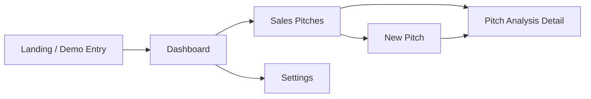

# Perfect Pitch

Perfect Pitch is a recruiter-facing mock SaaS demo for AI-assisted sales pitch coaching. It recreates the spirit of the original prototype as a polished Next.js App Router product that feels complete, stable, and easy to understand, while staying fully static and safe to deploy on Vercel.

## Product Overview

This demo is designed to help a recruiter understand the product idea in under a minute:

- enter a clean mock login experience
- view dashboard KPIs and recent pitch activity
- browse a sales pitch library with client-side filters
- simulate a new pitch workflow without any backend or real media pipeline
- open a detailed pitch analysis page with scorecards, feedback, transcript, model guidance, and admin review

## Demo Flow



## Tech Stack

- Next.js App Router
- React
- TypeScript
- Tailwind CSS v4
- Local mock data only

## Key Characteristics

- No backend, database, auth server, API integration, or AI pipeline
- No required environment variables
- No broken links or placeholder dead routes
- Safe client-side interactions only
- Vercel-friendly production build
- Desktop-first but responsive recruiter demo experience

## Included Routes

- `/` landing and mock login entry
- `/dashboard` KPI dashboard and score trend view
- `/sales-pitches` searchable pitch library
- `/sales-pitches/new` mock recording and upload flow
- `/sales-pitches/[id]` analysis detail screen
- `/settings` lightweight profile and demo preferences page

## Project Structure

```text
src/
  app/
    (app)/
      dashboard/
      sales-pitches/
      settings/
  components/
  lib/mock-data/
  types/
```

## Local Development

```bash
npm install
npm run dev
```

Open [http://localhost:3000](http://localhost:3000).

## Production Build

```bash
npm run lint
npm run build
npm run start
```

## Deploy to Vercel

1. Push this repository to GitHub.
2. Import it into [Vercel](https://vercel.com/new).
3. Deploy with the default Next.js settings.

This project does not require any environment variables, external APIs, or managed services.

## Notes

- All recruiter-facing content is powered by local mock data in `src/lib/mock-data/index.ts`.
- The new pitch screen does not request camera access on page load.
- Recording and upload flows are intentionally simulated for demo safety.
- The app is meant for product presentation, not production use.
