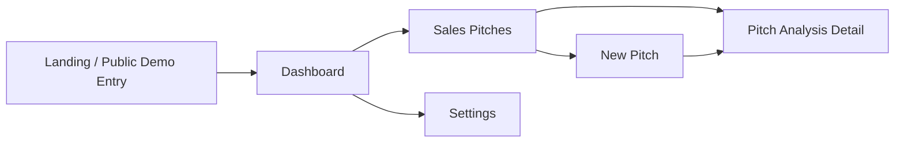

# Perfect Pitch

Perfect Pitch is a public mock SaaS demo for AI-assisted sales pitch coaching. It is built as a polished Next.js App Router product with dashboard-style analytics, populated demo data, and safe client-side interactions so anyone can open the site and experiment immediately.

## Product Overview

This demo is designed to help a visitor understand the product idea in under a minute:

- open the dashboard without needing an account
- view dashboard KPIs, score trends, pipeline health, and coaching tasks
- browse a sales pitch library with client-side filters
- simulate a new pitch workflow without any backend or real media pipeline
- open a detailed pitch analysis page with scorecards, feedback, transcript, model guidance, and admin review
- optionally use the landing-page demo login panel as a persona switcher

## Demo Flow



## Tech Stack

- Next.js App Router
- React
- TypeScript
- Tailwind CSS v4
- Local mock data only

## Key Characteristics

- No backend, database, auth server, API integration, or AI pipeline
- No required environment variables
- Public demo routes for frictionless exploration
- Preloaded sample pitch records, scorecards, activity, and coaching tasks
- Safe client-side interactions only
- Vercel-friendly production build
- Dashboard-first but responsive recruiter demo experience

## Included Routes

- `/` landing page, dashboard shortcuts, and optional mock login panel
- `/dashboard` dashboard workspace with KPIs, trends, pipeline health, activity, and coaching queue
- `/sales-pitches` searchable pitch library
- `/sales-pitches/new` mock recording and upload flow
- `/sales-pitches/[id]` analysis detail screen
- `/settings` lightweight profile and demo preferences page

## Project Structure

```text
src/
  app/
    (app)/
      dashboard/
      sales-pitches/
      settings/
  components/
  lib/mock-data/
  types/
```

## Local Development

```bash
npm install
npm run dev
```

Open [http://localhost:3000](http://localhost:3000).

Useful demo URLs:

- [http://localhost:3000/dashboard](http://localhost:3000/dashboard)
- [http://localhost:3000/sales-pitches](http://localhost:3000/sales-pitches)
- [http://localhost:3000/sales-pitches/pitch-101](http://localhost:3000/sales-pitches/pitch-101)

## Production Build

```bash
npm run lint
npm run build
npm run start
```

## Deploy to Vercel

1. Push this repository to GitHub.
2. Import it into [Vercel](https://vercel.com/new).
3. Deploy with the default Next.js settings.

This project does not require any environment variables, external APIs, or managed services.

Vercel can build the app with the default install and build commands:

- Install command: `npm install`
- Build command: `npm run build`
- Output: Next.js default

## Notes

- All dashboard and recruiter-facing content is powered by local mock data in `src/lib/mock-data/index.ts`.
- Demo routes are intentionally public so shared Vercel links are easy to review.
- The new pitch screen does not request camera access on page load.
- Recording and upload flows are intentionally simulated for demo safety.
- The app is meant for product presentation, not production use.
